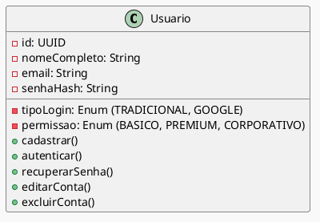
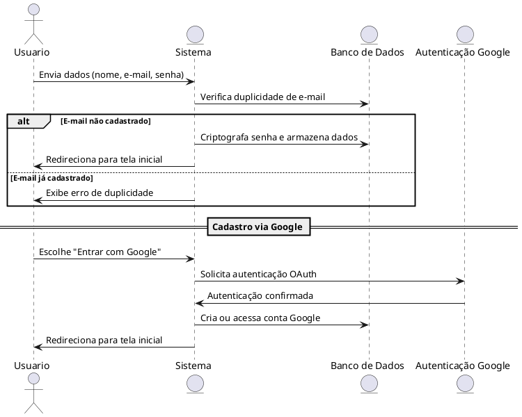

# Diagrama de Classes: Usuário  
- Cadastro com nome completo, e-mail e senha;  
- Login via Google;  
- Recuperação de senha por e-mail;  
- Senha armazenada com hash seguro;  
- Edição e exclusão da conta.

# Diagrama de Sequência - Cadastrar usuário

