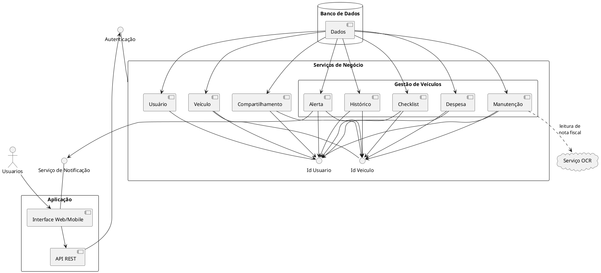

## Diagrama de Componentes

```puml

@startuml


actor Usuarios as User

rectangle "Aplicação" {
  component "Interface Web/Mobile" as UI
  component "API REST" as API
}

rectangle "Serviços de Negócio" as SN {
  component "Usuário" as Usuario
  component "Veículo" as Veiculo
  interface "Id Veiculo" as IdVeiculo
  interface "Id Usuario" as IdUsuario
  
  rectangle "Gestão de Veículos" {
    component "Manutenção" as Manutencao
    component "Alerta" as Alerta
    component "Despesa" as Despesa
    component "Histórico" as Historico
    component "Checklist" as Checklist
  }
  
  component "Compartilhamento" as Compartilhamento
}

database "Banco de Dados" as DB {
  component "Dados" as Dados
}

cloud "Serviço OCR" as OCR
interface "Serviço de Notificação" as Notif
interface "Autenticação" as Auth

User --> UI 
UI --> API
API --> Auth
Auth -- SN

Usuario -- IdUsuario
Veiculo -- IdVeiculo
Veiculo --> IdUsuario

Compartilhamento --> IdVeiculo
Compartilhamento --> IdUsuario

Manutencao --> IdVeiculo
Manutencao --> IdUsuario
Alerta --> IdVeiculo
Alerta --> IdUsuario
Alerta --> Notif
Notif -- UI
Despesa --> IdVeiculo
Despesa --> IdUsuario
Historico --> IdVeiculo
Historico --> IdUsuario
Checklist --> IdVeiculo
Checklist --> IdUsuario

Dados --> Usuario
Dados --> Veiculo
Dados --> Manutencao
Dados --> Alerta
Dados --> Despesa
Dados --> Historico
Dados --> Checklist
Dados --> Compartilhamento

Manutencao ..> OCR : leitura de\nnota fiscal

@enduml
```
