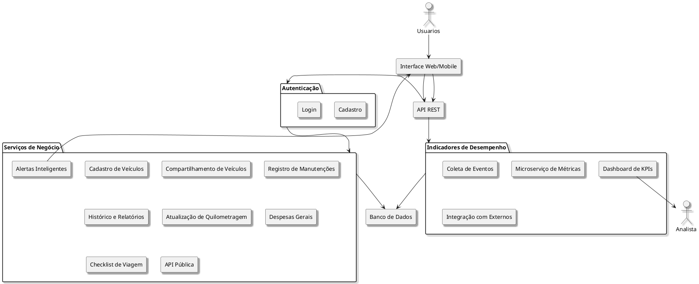

## Diagrama de Componentes

```puml
@startuml
skinparam componentStyle rectangle
skinparam shadowing true
skinparam component {

}

top to bottom direction
component "Interface Web/Mobile" as UI
component "API REST" as API
component "Banco de Dados" as DB
actor Analista
actor Usuarios


package "Autenticação" as AUT {
    [Cadastro]
    [Login]
  }

package "Indicadores de Desempenho" as KPI {
  [Dashboard de KPIs]
  [Coleta de Eventos]
  [Microserviço de Métricas]
  [Integração com Externos]
  }

package "Serviços de Negócio" as SN {
  [Cadastro de Veículos]
  [Compartilhamento de Veículos]
  [Registro de Manutenções]
  [Alertas Inteligentes]
  [Histórico e Relatórios]
  [Atualização de Quilometragem]
  [Despesas Gerais]
  [Checklist de Viagem]
  [API Pública]
}

Usuarios --> UI
UI  --> API
API --> AUT
AUT --> SN
[Alertas Inteligentes] --> UI
SN  --> DB
UI --> API
API --> KPI
KPI --> DB
[Dashboard de KPIs] --> Analista
@enduml

```
