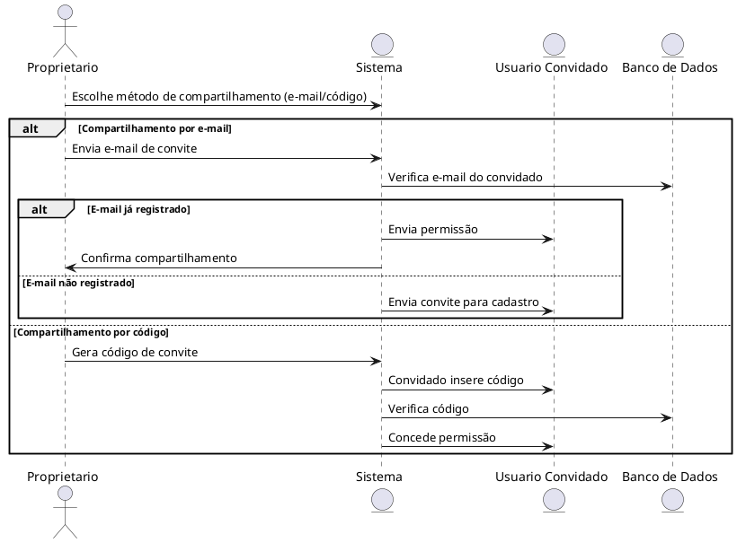

# Diagrama de Seguência - Compartilhar veículo

```puml
@startuml
actor Proprietario
entity "Sistema" as Sistema
entity "Usuario Convidado" as Convidado
entity "Banco de Dados" as BD

Proprietario -> Sistema: Escolhe método de compartilhamento (e-mail/código)
alt Compartilhamento por e-mail
    Proprietario -> Sistema: Envia e-mail de convite
    Sistema -> BD: Verifica e-mail do convidado
    alt E-mail já registrado
        Sistema -> Convidado: Envia permissão
        Sistema -> Proprietario: Confirma compartilhamento
    else E-mail não registrado
        Sistema -> Convidado: Envia convite para cadastro
    end
else Compartilhamento por código
    Proprietario -> Sistema: Gera código de convite
    Sistema -> Convidado: Convidado insere código
    Sistema -> BD: Verifica código
    Sistema -> Convidado: Concede permissão
end

@endum
```
