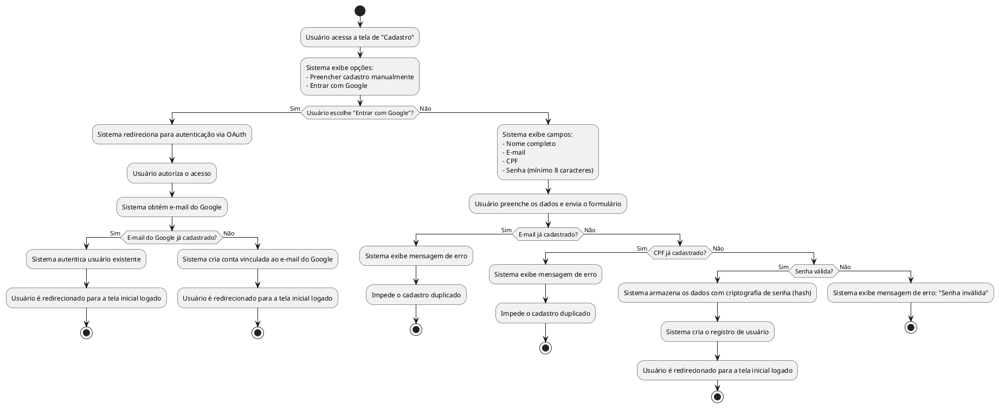

## Diagrama de Atividade: Cadastro de Usuário

- Cadastro com nome completo, e-mail e senha.  
- Cadastro via conta Google.  
- Senhas armazenadas com hash seguro.  
    

```puml
@startuml
start

:Usuário acessa a tela de "Cadastro";

:Sistema exibe opções:
- Preencher cadastro manualmente
- Entrar com Google;

if (Usuário escolhe "Entrar com Google"?) then (Sim)
  :Sistema redireciona para autenticação via OAuth;
  :Usuário autoriza o acesso;
  :Sistema obtém e-mail do Google;

  if (E-mail do Google já cadastrado?) then (Sim)
    :Sistema autentica usuário existente;
    :Usuário é redirecionado para a tela inicial logado;
    stop
  else (Não)
    :Sistema cria conta vinculada ao e-mail do Google;
    :Usuário é redirecionado para a tela inicial logado;
    stop
  endif

else (Não)
  :Sistema exibe campos:
  - Nome completo
  - E-mail
  - CPF
  - Senha (mínimo 8 caracteres);

  :Usuário preenche os dados e envia o formulário;

  if (E-mail já cadastrado?) then (Sim)
    :Sistema exibe mensagem de erro;
    :Impede o cadastro duplicado;
    stop
  else (Não)
    if (CPF já cadastrado?) then (Sim)
      :Sistema exibe mensagem de erro;
      :Impede o cadastro duplicado;
      stop
    else (Não)
      if (Senha válida?) then (Sim)
        :Sistema armazena os dados com criptografia de senha (hash);
        :Sistema cria o registro de usuário;
        :Usuário é redirecionado para a tela inicial logado;
        stop
      else (Não)
        :Sistema exibe mensagem de erro: "Senha inválida";
        stop
      endif
    endif
  endif
endif

@enduml

```
