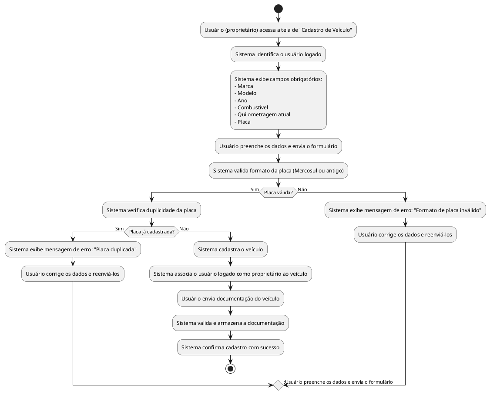

## Diagrama de Atividade: Cadastro de Veículo

- Permite o cadastro de múltiplos veículos por usuário logado.  
- Campos obrigatórios: marca, modelo, ano, combustível, quilometragem atual e placa.  
- Validação automática da placa (formatos Mercosul e antigo).  
- Prevenção de placas duplicadas com retorno para a etapa de preenchimento dos dados em caso de erro.  
- Associação automática do usuário logado como proprietário do veículo.  
- Inclusão obrigatória de documentação do veículo, com validação e armazenamento pelo sistema.  
- Caso de uso independente para a adição de motoristas autorizados, não contemplado neste diagrama.
  

