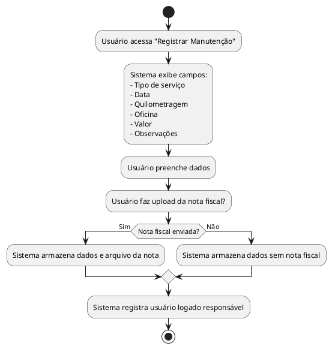

## Diagrama de Atividade: Manutenções do veículo

- Registro de tipo de serviço, data, quilometragem, oficina, valor e observações.  
- Opção de upload de nota fiscal durante o registro.  
- Armazenamento dos dados e arquivo da nota fiscal, se enviado.  
- Registro do usuário logado responsável pelo cadastro.

