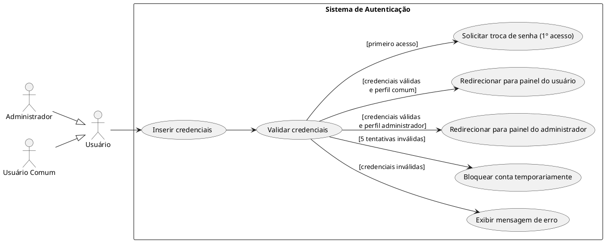

## 1 Identificação
- **Nome**: Login  
- **Ator Primário**: Usuário  
- **Descrição**: Permite que um usuário acesse o sistema mediante a inserção e validação de suas credenciais (usuário e senha).

---

## 1.1. Visão Geral

## 1.2. Fluxo Principal de Eventos
1. O usuário acessa a tela de login do sistema.
2. O sistema solicita que o usuário informe os dados
   1. nome de usuário
   2. senha
3. O usuário insere suas credenciais.
4. O sistema valida as credenciais fornecidas.
5. Se as credenciais forem válidas, o sistema identifica o perfil do usuário e redireciona para a interface correspondente:
   - Usuário comum: painel de usuário
   - Administrador: painel administrativo

---

## 1.3. Fluxos Alternativos

### 1.3.1. a. Credenciais Inválidas
1. O sistema detecta que as credenciais são inválidas.
2. O sistema exibe uma mensagem de erro: `"Usuário ou senha incorretos."`
3. O fluxo retorna para a etapa 2 do fluxo principal.

### 1.3.2. b. Primeiro Acesso
1. O sistema identifica que é o primeiro acesso do usuário.
2. O sistema solicita a troca da senha temporária por uma nova.
3. Após a troca, o usuário é redirecionado conforme seu perfil.

---

## 1.4. Fluxos de Exceção

### 1.4.1. a. Campos Vazios
- Se o usuário tentar enviar o formulário com campos em branco:
  - O sistema exibe uma mensagem: `"Preencha todos os campos obrigatórios."`
  - O fluxo retorna para a etapa 2.

### 1.4.2. b. Falha de Conexão com o Servidor
- Se houver falha de comunicação com o servidor de autenticação:
  - O sistema exibe uma mensagem: `"Erro de conexão. Tente novamente mais tarde."`
  - O sistema registra o incidente em log técnico.
  - O fluxo é encerrado.

### 1.4.3. c. Conta Bloqueada
- Se o usuário exceder o número de tentativas de login permitidas:
  - O sistema bloqueia temporariamente o login da conta.
  - Uma mensagem é exibida: `"Conta temporariamente bloqueada por tentativas incorretas. Tente novamente após 15 minutos."`
  - O fluxo é encerrado.

---

## 1.5. Pré-condições
- O sistema deve estar online e acessível.
- O usuário deve possuir uma conta previamente registrada.

---

## 1.6. Pós-condições
- O usuário está autenticado no sistema.
- O acesso às funcionalidades está liberado conforme o perfil do usuário.

---

## 1.7. Regras de Negócio
- Credenciais devem ser compostas por:
  - Usuário: entre 4 e 20 caracteres alfanuméricos.
  - Senha: mínimo de 8 caracteres, contendo letras e números.
- Após 5 tentativas inválidas consecutivas, o sistema bloqueia o acesso por 15 minutos.
- A autenticação define o perfil de acesso do usuário.
- Usuários inativos não podem efetuar login.

---

## 1.8. Perfis de Usuário
| Perfil            | Descrição                                                 | Acesso ao sistema     |
| ----------------- | --------------------------------------------------------- | --------------------- |
| **Administrador** | Usuário com permissões avançadas de gerenciamento.        | Painel administrativo |
| **Usuário comum** | Usuário com acesso limitado às suas próprias informações. | Painel do usuário     |
| **Inativo**       | Usuário desativado ou bloqueado pelo administrador.       | Acesso negado         |

