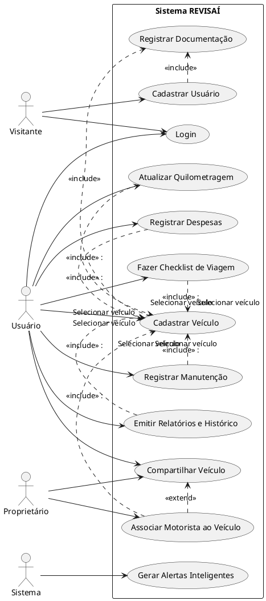

# 📊 Diagramas UML do Sistema

# Visão Geral do Sistema

# 🔹Diagrama de caso de uso

[Imagem do diagrama e o descritivo](./casoDeUso/UC_Diagrama_VisaoGeral.md) 

# 🔹Diagrama de Atividade

| Nome                               | Descrição breve             | Observações |
| ---------------------------------- | --------------------------- | ----------- |
| [Cadastrar Usuário](./atividade/UC_Cadastro_Usuário.md) | Permite o cadastro de usuário | -           |
| [Cadastrar Veiculo](./atividade/UC_Cadastro_Veículo.md) | Permite o cadastro de veiculo | -           |
| [Compartilhar Veículos](./atividade/UC_Compartilhar_Veículo.md) | Permite o compartilhamento de veiculo | -           |
| [Registrar Manutenções](./atividade/UC_Manutenção.md) | Permite o registro de manutenção do veiculo | -           |
| [Emitir Históricos e Relatórios](./atividade/UC_Emitir_Relatório.md) | Permite a emição de relatórios e o histórico do veiculo | -           |
| [Atualizar Quilometragem](./atividade/UC_Quilometragem.md) | Permite a atualização manual da quilometragem do veiculo | -           |
| [Registrar Despesas Gerais](./atividade/UC_Registro_Despesas.md) | Permite o registro e emição das despesas do veiculo | -           |
| [Fazer Checklist de Viagem](./atividade/UC_Checklist.md) | Permite a criação de uma checklist com base na distância da viagem | -           |

# 🔹 Diagrama de Classes

| Nome                                     | Descrição breve                                               | Observações |
|------------------------------------------|----------------------------------------------------------------|-------------|
| [Diagrama de Classes](./classe/Diagrama_Classes.md)               | contem todo o diagrama das classes apresentadas no projeto. | -           |

# 🔹 Diagrama de Estados

| Nome                                     | Descrição breve                                               | Observações |
|------------------------------------------|----------------------------------------------------------------|-------------|
| [Usuario](./estado/DE_usuario.md)               | Representa os estados possíveis da conta de um usuário. | -           |
| [Veiculo](./estado/DE_Veiculo.md)               | Mostra os estados de um veículo no sistema:cadastro, compartilhamento, transferência ou exclusão.         | -           |
| [Manutencao](./estado/DE_Manutencao.md)         | Reflete o ciclo de vida de uma manutenção veicular      | -           |
| [Historico](./estado/DE_H_Manutencao.md)        | Permite mostrar todo o historico de manutenção deo veiculo. | -           |
| [Alerta](./estado/DE_AL_Manutencao.md)          | Descreve o comportamento dos alertas inteligentes do sistema, desde a geração até o encerramento. | -           |

