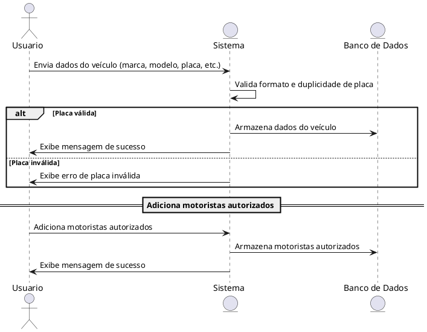

# Diagrama de Seguência - Cadastrar veículo

```puml
@startuml
actor Usuario
entity "Sistema" as Sistema
entity "Banco de Dados" as BD

Usuario -> Sistema: Envia dados do veículo (marca, modelo, placa, etc.)
Sistema -> Sistema: Valida formato e duplicidade de placa
alt Placa válida
    Sistema -> BD: Armazena dados do veículo
    Sistema -> Usuario: Exibe mensagem de sucesso
else Placa inválida
    Sistema -> Usuario: Exibe erro de placa inválida
end

== Adiciona motoristas autorizados ==
Usuario -> Sistema: Adiciona motoristas autorizados
Sistema -> BD: Armazena motoristas autorizados
Sistema -> Usuario: Exibe mensagem de sucesso

@enduml
```
