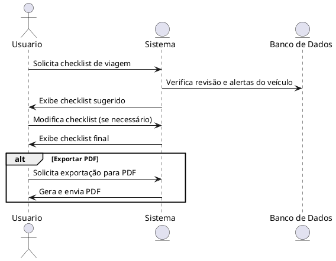

# Diagrama de Sequência - Checklist de Viagem

```puml
@startuml
actor Usuario
entity "Sistema" as Sistema
entity "Banco de Dados" as BD

Usuario -> Sistema: Solicita checklist de viagem
Sistema -> BD: Verifica revisão e alertas do veículo
Sistema -> Usuario: Exibe checklist sugerido

Usuario -> Sistema: Modifica checklist (se necessário)
Sistema -> Usuario: Exibe checklist final

alt Exportar PDF
    Usuario -> Sistema: Solicita exportação para PDF
    Sistema -> Usuario: Gera e envia PDF
end
@enduml
```
