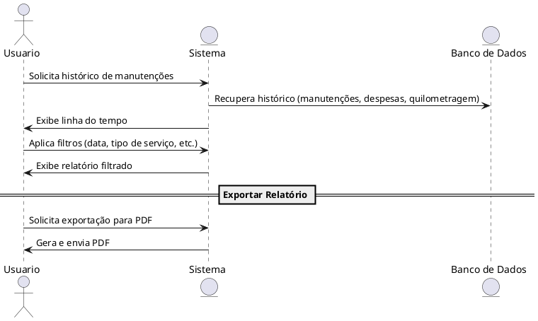

# Diagrama de Sequência - Emitir Histórico e Relatórios

```puml
@startuml
actor Usuario
entity "Sistema" as Sistema
entity "Banco de Dados" as BD

Usuario -> Sistema: Solicita histórico de manutenções
Sistema -> BD: Recupera histórico (manutenções, despesas, quilometragem)
Sistema -> Usuario: Exibe linha do tempo

Usuario -> Sistema: Aplica filtros (data, tipo de serviço, etc.)
Sistema -> Usuario: Exibe relatório filtrado

== Exportar Relatório ==
Usuario -> Sistema: Solicita exportação para PDF
Sistema -> Usuario: Gera e envia PDF
@enduml
```
