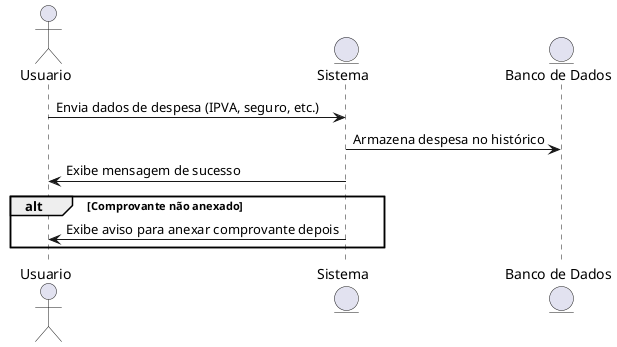

# Diagrama de Sequência - Registrar Despesas Gerais

```puml
@startuml
actor Usuario
entity "Sistema" as Sistema
entity "Banco de Dados" as BD

Usuario -> Sistema: Envia dados de despesa (IPVA, seguro, etc.)
Sistema -> BD: Armazena despesa no histórico
Sistema -> Usuario: Exibe mensagem de sucesso

alt Comprovante não anexado
    Sistema -> Usuario: Exibe aviso para anexar comprovante depois
end
@enduml
```
