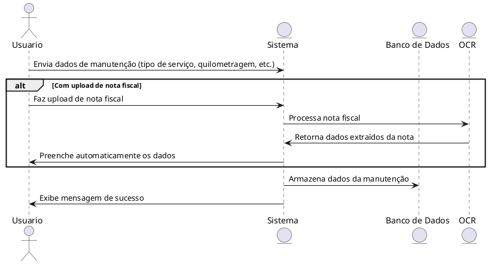

# Diagrama de Sequência - Registrar Manutenções

```puml
@startuml
actor Usuario
entity "Sistema" as Sistema
entity "Banco de Dados" as BD
entity "OCR" as OCR

Usuario -> Sistema: Envia dados de manutenção (tipo de serviço, quilometragem, etc.)

alt Com upload de nota fiscal
    Usuario -> Sistema: Faz upload de nota fiscal
    Sistema -> OCR: Processa nota fiscal
    OCR -> Sistema: Retorna dados extraídos da nota
    Sistema -> Usuario: Preenche automaticamente os dados
end

Sistema -> BD: Armazena dados da manutenção
Sistema -> Usuario: Exibe mensagem de sucesso
@enduml
```
